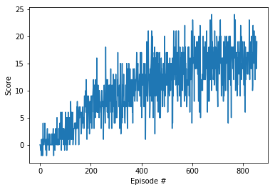

#Project Report

##Project Implementation
Different aspects of implementation have been mentioned below:

####Learning Algorithm
The learning algorithm used to train the agent is Deep Q-Network with experience replay. The model used to train the agent consists of three fully-connected layers with ReLu activation function used to trigger the output of intermediate states. The first two layers have size 64 while the third layer being the output layer has same size as that of action space (4).

####Hyperparameters
The following hyperparameters have been set for learning:

* The replay buffer size is 10000.

* Learning batch size is selected as 64.

* The discount rate is selected as 0.99.

* Soft-update rate of target weights is 1e-3.

* Learning-rate of 5e-4 is selected.

* Starting value of epsilon is 1 with a decay rate of 0.995 and a minimum value of 0.01.

##Results
The agent required 856 episodes to train itself to achieve an average score of 16 for last 100 episodes.

##Future Ideas
Deep Q-Network with experience replays was used in to train the agent. similarly, prioritized replay can be employed instead of simple (random) replay or other extensions of DQN like double DQN or dueling DQN can be used. 

However, for a vector state space of 37 states, the used neural network architecture with only fully-connected layers is quite sufficient. But, for a 2-dimensional state-space (like an image) an expanded neural network with convolutional layers at first can be used.